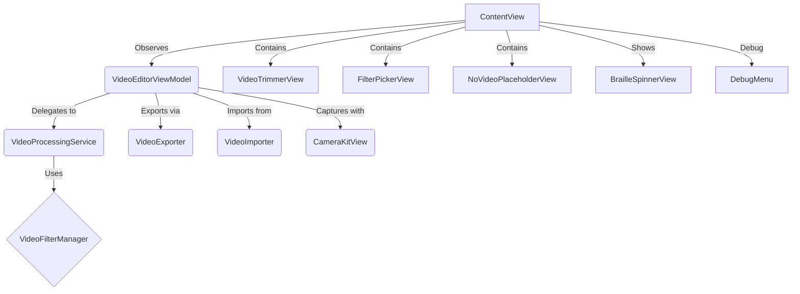

# Loopa

**Loopa** is a SwiftUI video-editing playground for iOS. Import or capture a video clip, trim it with visual feedback, preview 11 Core Image filters in real-time with animated thumbnails, and export your masterpiece as either a filtered `.mov` video or an animated `.gif` – all on device.

---

## ✨ Features

### 🎬 Video Input & Capture
* **Video Import** – Photos-picker integration (`PHPickerViewController`) for one-tap import
* **Camera Capture** – Built-in video recording with `CameraKitView` and `VideoCaptureView`
* **Real-time Preview** – SwiftUI interface with live preview using `AVPlayer`

### 🎨 Visual Effects & Editing
* **11 Built-in Filters** – Comprehensive filter set powered by Core Image:
  - None, Sepia, Comic, Posterize, Noir, Mono, Blur, Vignette, Bloom, Pixelate, Invert
* **Live Filter Previews** – Animated thumbnail gallery with wave animations
* **Visual Trimming** – Film-strip view with draggable handles and time tooltips
* **Playhead Tracking** – Real-time video position indicator with time display

### 📱 User Experience
* **Animated Loading States** – Braille spinner and shimmer effects
* **Spring Animations** – Cascading filter animations and responsive interactions
* **Time Display** – Precise MM:SS.d format timers throughout the interface
* **Debug Tools** – Developer menu for testing and animation triggers

### 💾 Export & Sharing
* **GIF Export** – Configurable frame-rate (6, 12, 24, 30 FPS) & custom duration
* **Video Export** – Save filtered videos with applied effects
* **Multiple Output Options** – Save to Photos, copy to clipboard, or share
* **Background Processing** – Dedicated `VideoProcessingService` for smooth performance

### 🏗️ Architecture
* **MVVM Pattern** – Clean separation with `VideoEditorViewModel`
* **Swift 6 Ready** – Full concurrency support with async/await and `@MainActor`
* **Modular Design** – Reusable components and services
* **Comprehensive Testing** – Unit & UI tests that run on-device / Simulator

---

## 🏛 Architecture



### Component Overview

* **Views (SwiftUI)**
  * `ContentView` – Main interface with video preview and controls
  * `VideoTrimmerView` – Film strip with draggable trim handles and tooltips
  * `FilterPickerView` – Animated filter gallery with live thumbnails
  * `NoVideoPlaceholderView` – Empty state with animated call-to-action
  * `BrailleSpinnerView` – Custom loading animation
  * `DebugMenu` – Developer tools and animation triggers

* **ViewModels & Services**
  * `VideoEditorViewModel` – Main state management with `@MainActor` safety
  * `VideoProcessingService` – Background video processing and thumbnail generation

* **Core Utilities**
  * `VideoFilterManager` – Core Image filter implementations
  * `VideoExporter` – Export to video/GIF with background processing
  * `VideoImporter` – PHPicker integration for media selection
  * `CameraKitView` & `VideoCaptureView` – Video recording capabilities
  * `AVAsset+SafeLoad` – Safe async property loading extension

---

## 🚀 Getting Started

### Prerequisites

* Xcode 16 (or newer – project uses Swift 5.9 & Swift 6 warnings)
* macOS 15.5 or newer

### Clone & Open

```bash
git clone https://github.com/arach/Loopa.git
cd Loopa
open Loopa.xcodeproj
```

### Run in Simulator

1. Select the *Loopa* scheme.  
2. Choose an iOS 16+ simulator (e.g. *iPhone 16*).  
3. Hit **⌘R**.

---

## 🧩 Swift Package Manager

`LoopaCore` is an SPM library target that contains all reusable logic.  This enables:

* Importing Loopa features into other apps.
* `swift build` / `swift test` for macOS-compatible code.

> Note: UI-centric files are conditionally compiled with `#if canImport(UIKit)` and excluded from macOS builds.

---

## 🔧 Building & Testing from CLI

### Build App

```bash
xcodebuild build \
  -scheme Loopa \
  -destination 'platform=iOS Simulator,name=iPhone 16'
```

### Run Unit & UI Tests

```bash
xcodebuild test \
  -scheme Loopa \
  -destination 'platform=iOS Simulator,name=iPhone 16'
```

### Swift Package Tests (macOS-only parts)

```bash
swift test
```

---

## 📁 Project Structure

```
Loopa/
├─ Loopa/                    # App target (SwiftUI views, iOS-only)
│  ├─ ContentView.swift         # Main interface
│  ├─ VideoEditorViewModel.swift # State management
│  ├─ VideoProcessingService.swift # Background processing
│  ├─ VideoFilterManager.swift   # Core Image filters
│  ├─ VideoExporter.swift       # Export functionality
│  ├─ VideoImporter.swift       # Photo picker integration
│  ├─ CameraKitView.swift       # Video recording
│  ├─ VideoCaptureView.swift    # Camera interface
│  ├─ VideoTrimmerView.swift    # Film strip editor
│  ├─ FilterPickerView.swift    # Filter gallery (in ContentView)
│  ├─ NoVideoPlaceholderView.swift # Empty state
│  ├─ BrailleSpinnerView.swift  # Loading animation
│  ├─ DebugMenu.swift           # Developer tools
│  ├─ AVAsset+SafeLoad.swift    # Async extensions
│  ├─ Assets.xcassets/          # Images and colors
│  │  └─ film_sprockets.imageset/ # Trimmer background
│  └─ Media/                    # Asset resources
│     └─ film_sprockets.png
├─ Media/                    # Test media files
│  └─ coffee.mov
├─ LoopaTests/               # XCTest unit tests (+ resources)
│  ├─ LoopaTests.swift
│  └─ test_video.mov
├─ LoopaUITests/             # UI test target
├─ Package.swift             # SPM manifest (LoopaCore)
├─ CLAUDE.md                 # AI assistant context
└─ README.md
```

---

## 🤝 Contributing

1. Fork the repo & create your branch (`git checkout -b feature/AmazingFeature`).
2. Commit your changes (`git commit -m 'Add some AmazingFeature'`).
3. Push to the branch (`git push origin feature/AmazingFeature`).
4. Open a Pull Request.

---

## 📄 License

Licensed under the MIT License – see [`LICENSE`](LICENSE) for details. 