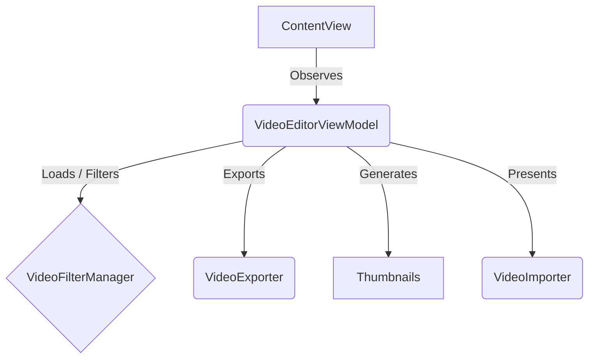

# Loopa

**Loopa** is a SwiftUI video-editing playground for iOS.  Import a clip, trim it, preview Core Image filters in real-time, and export your masterpiece as either a filtered `.mov` video or an animated `.gif` – all on device.

---

## ✨ Features

* SwiftUI interface with real-time preview using `AVPlayer`  
* Thumbnail film-strip generator for quick scrubbing  
* Built-in filter set (None, Sepia, Noir, Mono, Blur) powered by Core Image  
* GIF exporter with configurable frame-rate & duration  
* Photos-picker integration (`PHPickerViewController`) for one-tap import  
* Sandbox-safe save-to-Photos & copy-to-clipboard actions  
* MVVM architecture & async/await throughout  
* Unit & UI tests that run on-device / Simulator

---

## 🏛 Architecture



* **View (SwiftUI)** – `ContentView`, `FilmStripView`, `FilterPickerView`, `VideoTrimmerView`, `GIFView`
* **ViewModel** – `VideoEditorViewModel` (published state & user intents)
* **Model / Utilities**  
  * `VideoFilterManager` – Core Image helpers  
  * `VideoExporter` – `AVAssetExportSession` & GIF writer  
  * `VideoImporter` – PHPicker wrapper

---

## 🚀 Getting Started

### Prerequisites

* Xcode 16 (or newer – project uses Swift 5.9 & Swift 6 warnings)
* macOS 15.5 or newer

### Clone & Open

```bash
git clone https://github.com/your-org/Loopa.git
cd Loopa
open Loopa.xcodeproj
```

### Run in Simulator

1. Select the *Loopa* scheme.  
2. Choose an iOS 16+ simulator (e.g. *iPhone 16*).  
3. Hit **⌘R**.

---

## 🧩 Swift Package Manager

`LoopaCore` is an SPM library target that contains all reusable logic.  This enables:

* Importing Loopa features into other apps.
* `swift build` / `swift test` for macOS-compatible code.

> Note: UI-centric files are conditionally compiled with `#if canImport(UIKit)` and excluded from macOS builds.

---

## 🔧 Building & Testing from CLI

### Build App

```bash
xcodebuild build \
  -scheme Loopa \
  -destination 'platform=iOS Simulator,name=iPhone 16'
```

### Run Unit & UI Tests

```bash
xcodebuild test \
  -scheme Loopa \
  -destination 'platform=iOS Simulator,name=iPhone 16'
```

### Swift Package Tests (macOS-only parts)

```bash
swift test
```

---

## 📁 Project Structure

```
Loopa/
├─ Loopa/                    # App target (SwiftUI views, iOS-only)
│  ├─ ContentView.swift
│  ├─ VideoEditorViewModel.swift
│  ├─ VideoFilterManager.swift
│  ├─ VideoExporter.swift
│  ├─ VideoImporter.swift
│  └─ ...
├─ LoopaTests/               # XCTest unit tests (+ resources)
│  ├─ LoopaTests.swift
│  └─ test_video.mov
├─ LoopaUITests/             # UI test target
├─ Package.swift             # SPM manifest (LoopaCore)
└─ README.md
```

---

## 🤝 Contributing

1. Fork the repo & create your branch (`git checkout -b feature/AmazingFeature`).
2. Commit your changes (`git commit -m 'Add some AmazingFeature'`).
3. Push to the branch (`git push origin feature/AmazingFeature`).
4. Open a Pull Request.

---

## 📄 License

Licensed under the MIT License – see [`LICENSE`](LICENSE) for details. 